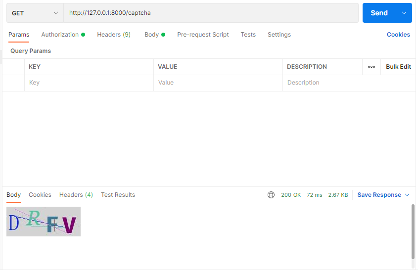
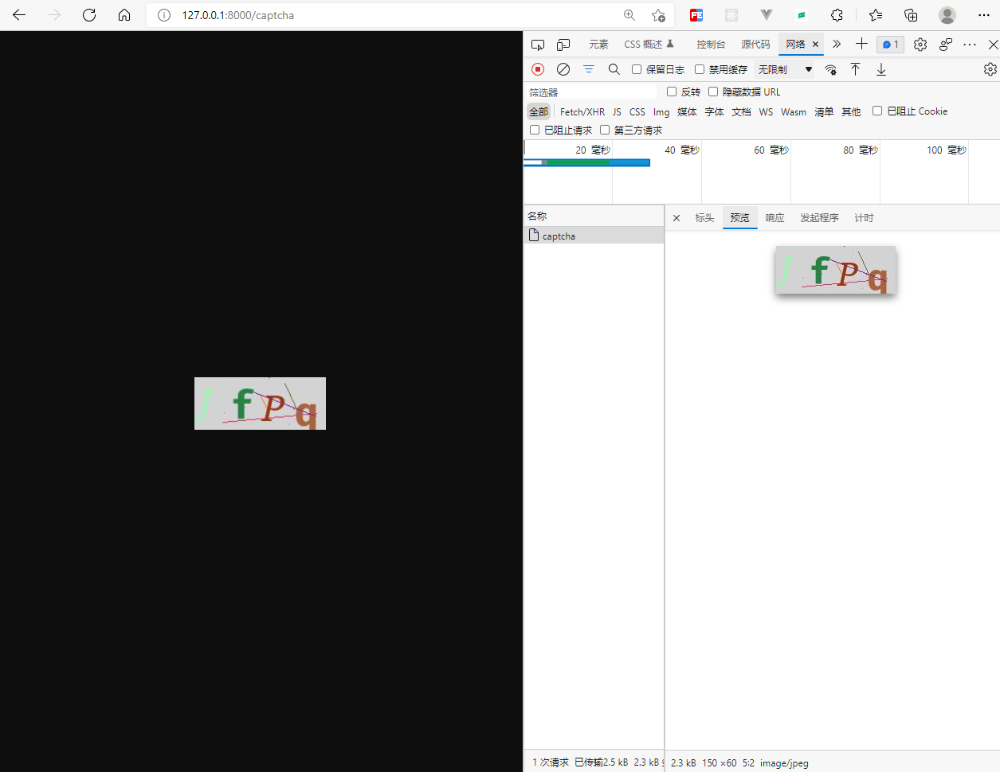

# simpel_captcha
> 提供分别生成图片验证码和文本验证码的方法，可结合 [FastAPI](https://fastapi.tiangolo.com/) 或者 [starlette](https://www.starlette.io/) 中的`StreamingResponse`返回图片验证码

# API
## captcha
> 生成文字验证码，接受一个num参数，关系到生成的验证码位数

```python
from simpel_captcha import captcha

print(f'验证码: {captcha(6)}')
```
output:
```shell
验证码: TjXP
```
## img_captcha
> 生成图片验证码, 返回数据为元组 `(Image| BytesIO, captcha)`

```python
from simpel_captcha import img_captcha

image, text = img_captcha()

print(f'图片对象: {image}')
print(f'验证码: {text}')
```
output:
```shell
图片对象: <PIL.Image.Image image mode=RGB size=100x30 at 0x1C7A0CAA7C0>
验证码: TjXP
```
# [FastAPI](https://fastapi.tiangolo.com/)
```python
from fastapi import FastAPI
from fastapi.responses import StreamingResponse

from simpel_captcha import img_captcha

app = FastAPI()


@app.get("/captcha", summary='图片验证码')
def image_captcha():
    image, text = img_captcha(byte_stream=True)
    # todo 将验证码缓存到Redis中 
    return StreamingResponse(content=image, media_type='image/jpeg')
```
# [starlette](https://www.starlette.io/)
```python
from starlette.applications import Starlette
from starlette.responses import StreamingResponse
from starlette.routing import Route

from simpel_captcha import img_captcha


async def captcha(request):
    image, text = img_captcha(byte_stream=True)
    # todo 将验证码缓存到Redis中 
    return StreamingResponse(content=image, media_type='image/jpeg')


app = Starlette(debug=True, routes=[
    Route('/captcha', captcha)
])
```
output:
  


# LICENSE
```text
MIT License

Copyright (c) 2022 柒意

Permission is hereby granted, free of charge, to any person obtaining a copy
of this software and associated documentation files (the "Software"), to deal
in the Software without restriction, including without limitation the rights
to use, copy, modify, merge, publish, distribute, sublicense, and/or sell
copies of the Software, and to permit persons to whom the Software is
furnished to do so, subject to the following conditions:

The above copyright notice and this permission notice shall be included in all
copies or substantial portions of the Software.

THE SOFTWARE IS PROVIDED "AS IS", WITHOUT WARRANTY OF ANY KIND, EXPRESS OR
IMPLIED, INCLUDING BUT NOT LIMITED TO THE WARRANTIES OF MERCHANTABILITY,
FITNESS FOR A PARTICULAR PURPOSE AND NONINFRINGEMENT. IN NO EVENT SHALL THE
AUTHORS OR COPYRIGHT HOLDERS BE LIABLE FOR ANY CLAIM, DAMAGES OR OTHER
LIABILITY, WHETHER IN AN ACTION OF CONTRACT, TORT OR OTHERWISE, ARISING FROM,
OUT OF OR IN CONNECTION WITH THE SOFTWARE OR THE USE OR OTHER DEALINGS IN THE
SOFTWARE.
```